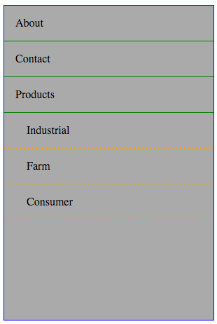

# Revisiting HTML

### Learning Objectives:
After this lesson you will

- be able to define the terms *tag*, *attribute*, *name-value pair*, *parent*, *child*
- understand which tags are self-closing
- be able to draw a tree representing the contents of an HTML document

## HTML
When we look at some HTML:

```HTML
<html>
  <head>
    <title>Casual Catwear, Inc.</title>
  </head>
  <body>
    <h1>Casual Catwear, Inc.</h1>
    <p>
      Specializing in bespoke sweaters and boots for your fussy feline friends.
    </p>
    
    <input type="password"
      placeholder="what's your password?">
  </body>
</html>
```

We see a lot of things going on, but the thing that matters most are *tags*.

### Tags

A tag in HTML is simply anything of the form `<` + `tagname` + `>`.  Example tags from above are the `<html>` tag, the `<body>` tag, and the `<p>` tag.  

You may notice that a large number of the tags have complementary *closing tags*, which are tags of the form `</` + `tagname` + `>`.  These tags will match an opening tag in name, and only differ by having that slash (`/`) before the tag's name.  These are important, since they'll tell the browser when a tag is finished with its job.  

#### Self-closing tags

There are tags which don't require the matching closing tag, and those are *self-closing tags*.  Examples of self closing tags are:

```html

<hr>
<input type='text'>
```

As of `HTML5`, the following tags (also known as *Void Tags*) are self-closing:

* area
* base
* br
* col
* embed
* hr
* img
* input
* keygen
* link
* meta
* param
* source
* track
* wbr

Everything else needs a matching tag.

#### Attributes

When you see an element like this link tag below:

```html
<a class="link external-link" href="https://google.com" target="_blank">
  Yahoo
</a>
```

You should notice several pairs of the form `attribute="value"`.  We call those *name-value pairs*, and there are many common ones, such as:

* id (note, ALWAYS UNIQUE within the same page)
* class
* href
* src

They're a way to store data that the browser will use to do its job correctly.  For example, the `class` attribute will store class names which correspond to styling information.

##### Exercise 1 (5 minutes)

Pardon my french, but go visit [http://motherfuckingwebsite.com/](http://motherfuckingwebsite.com/).  It's funny, a bit brusque, but it also contains some very simple HTML.  

Inspect the HTML and:
1. Find an example of a self-closing tag.
2. Find a name-value pair, and report the attribute and value.

### Nesting

One of the most important things about HTML is that tags can be nested.  In the example above, the `<html>` tag actually contains all other tags.  

The next two tags, `<head>` and `<body>` separate the document into two clear parts:

* `<head>` is where we put things like `<style>` information, `<meta>` tags, and the document `<title>` (which shows up in the browser bar)
* `<body>` is where we put the body of the document, or the things we actually intend for the user to see.

If you've ever explored front end CSS frameworks, you've likely seen code that looks like this:

```HTML
<div class="row">
  <div class="col-sm-8 blog-main">
    <div class="blog-post">
      <h2 class="blog-post-title">Sample blog post</h2>
      <p class="blog-post-meta">January 1, 2014 by <a href="#">Mark</a></p>

      <p>This blog post shows a few different types of content that's supported and styled with Bootstrap. Basic typography, images, and code are all supported.</p>
      <hr>
      <p>Cum sociis natoque penatibus et magnis <a href="#">dis parturient montes</a>, nascetur ridiculus mus. Aenean eu leo quam. Pellentesque ornare sem lacinia quam venenatis vestibulum. Sed posuere consectetur est at lobortis. Cras mattis consectetur purus sit amet fermentum.</p>
      <blockquote>
        <p>Curabitur blandit tempus porttitor. <strong>Nullam quis risus eget urna mollis</strong> ornare vel eu leo. Nullam id dolor id nibh ultricies vehicula ut id elit.</p>
      </blockquote>
    </div>
  </div>
</div>
```

When an outer tag contains an inner tag, we call the outer tag the *parent*, and the inner tag a *child*.  Likewise we can use the familiar terms *descendent* and *ancestor* to describe relationships further than one level.  

For this reason, we can think of a document as a family tree, with the `<html>` tag as being the ultimate ancestor.  Since we think of it as a tree, we often call the `<html>` tag the *root* element.

At this point you have an idea of what the word `document` refers to in what will become the **Document Object Model**, or DOM for short.

##### Exercise 2 (5 minutes)

For the code example above, draw a tree for all tags contained in the example.  You don't need to include the text content, or any attributes for the tags when drawing the tree.  

*Be careful!*  Many of the tags have secret hidden tags inside of them.  

## Micro-Lab 1 (60 minutes)

Create the content for a personal `about.html` page.  Include:

1. a header for your page with your name in it
2. an image of yourself
3. a header for the next section which says something like "Who am I?"
4. _three_ paragraphs explaining:
    - who you are
    - something you're passionate about
    - what you're looking to do with your life
5. a quote that's meaningful to you, in a `blockquote` tag
6. a header for the next section which says something like "Pictures"
7. _three_ pictures of things you like, or have accomplished
8. a footer including the most recent date you've updated this page

---

# Cascading Style Sheets, or CSS

### Learning Objectives:
After this lesson you will

- be able to define `selector`, `tag`, `class`, `id` with respect to CSS
- be able to define `property` and `value` with respect to CSS
- understand the concept of `specificity`
- be able to write selectors to style specific elements in your document
- be able to describe the difference between `block` and `inline` elements

## CSS

When we look at tag in a document, such as `<div class="logo">`, there are a few distinguishing features.  *This* tag has a tag name of `div`, and a class name of `logo`.  It's missing an `id`, but that's ok.

(A brief note on ids: The value for any given id **must not** be the same as any other id on the same page.  Think of an `id` as a social security number.  It's a way to identify a specific element.)

If you were to give me instructions to find that element you might tell me to look for a `div`, or you might tell me to look for something with a class named `logo`.

##### Exercise (5 minutes)

```html
<header class="nav-header">
  <div class="logo">
    <a class="home-anchor" href="/">My Company</a>
  </div>
  <nav>
    <ul class="menu">
      <li><a id="about" href="/about">About Us</a></li>
      <li><a id="contact" href="/contact">Contact Us</a></li>
      <li><a id="hours" href="/hours">Hours</a></li>
    </ul>
  </nav>
</header>
```

Neighbor 1: Pick an element, and explain to your neighbor how to find it.  
Neighbor 2: Be difficult!  If there are multiple elements which match it based on the description, ask for more information.

Switch back and forth.

### Selectors

The way we combine tag names, class names, and ids to describe elements in our document is through something called a selector.

```CSS
div {}    /* tag name */
.logo {}  /* class name */
#about {} /* id */
```

A selector will look for all elements in the document that it matches, and will apply the styling directives to all of them.

##### Exercise (5 minutes)

Given the following selectors, list all elements from our previous exercise which will get something other than the default styling.  Ultimately what will each of them look like?

```CSS
header {
  background: darkgreen;
}

a {
  color: white;
}

.home-anchor {
  font-size: 48px;
}
```

### Combining Selectors

It's possible to combine multiple properties into one selector.  

```CSS
div.logo {}                 /* div AND class name logo */
a#home {}                   /* anchor tag with id home */
ul#navigation.pull-right {} /*
  unordered list, id of "navigation", class name of "pull-right"
*/
```

This allows us to be much more specific about which elements get styled a certain way.

##### Exercise (5 minutes)

For the previous HTML, write 3 selectors using as many properties as possible.

### Complicated Selectors

Given two selectors (e.g. `frap` and `div.grog` ), it's possible to combine them into a new selector describing one of many situations:

1. `A > B` (Style B, which is an _immediate_ descendent {aka a child} of A)

    ```css
    #frap > div.grog {
      background: orange; /*
        only a div with class 'grog' immediately nested inside an element
        with id 'frap' will get this style
      */
    }
    ```

    ```html
    <section id="frap">
      <article>
        <div class="grog">
          This won't get the style from above.
        </div>
      </article>
      <div class="grog">
        This will!
      </div>
    </section>
    ```

2. `A B` (Style B, which is an _eventual_ descendent of A)

    ```css
    #frap div.grog {
      background: orange; /*
        only a div with class 'grog' nested anywhere inside an element
        with id 'frap' will get this style
      */
    }
    ```

    ```html
    <section id="frap">
      <article>
        <div class="grog">
          This will get the style from above.
        </div>
      </article>
      <div class="grog">
        This will, too!
      </div>
    </section>
    ```

3. `A + B` (Style B, which is the immediate next sibling of A)

    ```css
    #frap + div.grog {
      background: orange; /*
        only a div with class 'grog' appearing immediately after an element
        with id 'frap' at the same level will get this style
      */
    }
    ```

    ```html
    <section id="frap">
    </section>
    <div class="grog">
      This will get the style from above.
    </div>
    <div class="grog">
      This won't!
    </div>
    ```

<<<<<<< HEAD
4. `A + B` (Style B, which is any sibling of A appearing after A)
=======
4. `A ~ B` (Style B, which is any sibling of A appearing after A)
>>>>>>> b4fedb7ad7021f449a37216b16510ed1b0fd61ea

    ```css
    #frap ~ div.grog {
      background: orange; /*
        only a div with class 'grog' appearing anywhere after an element
        with id 'frap' at the same level will get this style
      */
    }
    ```

    ```html
    <section id="frap">
    </section>
    <div class="grog">
      This will get the style from above.
    </div>
    <div class="grog">
      This will, too!
    </div>
    ```

##### Exercise (20 minutes)

Open up the file `navigation.html`:

There are nested `ul` and `li` elements.  Every `li` also has a link.

Try to use nesting selectors to style the document so that it looks like this:



### Block vs Inline

One last thing.  When you imagine an element in your HTML, you want to think of it as living inside a box.  There are two types of boxes, and they differ in how they are inserted into your document.

1. Block elements:
  * start on a new line
  * have width equal to their parent element
  * have height equal to their content
  * break to the next available line for content following them
2. Inline elements:
  * are treated as text for positioning
  * have width equal to their content
  * have height equal to surrounding content
  * wrap to the next line at end of line

Examples of **block** elements are:
  * Footer tag `<footer>`
  * Navigation tag `<nav>`
  * List tags `<ol>`, `<ul>`, and `<li>`
  * The quintessential `<div>`

Examples of **inline** elements are:
  * Anchor tag `<a>`
  * The quintessential `<span>` element
  * Form elements `<button>`, `<input>`, `<label>`, `<select>`, `<textarea>`

##### Exercise (10 minutes)

Style the `casual_catwear.html` file in this directory.  Make sure everything has at least one style applied to it.

### Specificity

CSS declarations are read and applied from top to bottom.  If two declarations are equally specific and both style the same property, then the one that is defined last (top-to-bottom) will be the one that wins.

What does it mean for two declarations to be equally specific?

1. Inline styles win over everything else
2. Existence of an id beats a declaration without an id
3. Number of classes in the declaration is the next tie-breaker
4. Number of elements / pseudo elements is the final tie-breaker
5. Then closeness to the bottom of the stylesheet decides

##### Exercise (5 minutes)

Sort the following in order of specificity

1. `div.purple`
2. `div#orange`
3. `#orange`
4. `.green#orange`
5. `div.purple.omega-element`
6. `.purple.omega-element`
7. `div#orange.omega-element`


## Micro-Lab 2 (60 minutes)

Go back and style your `about.html` from earlier!
